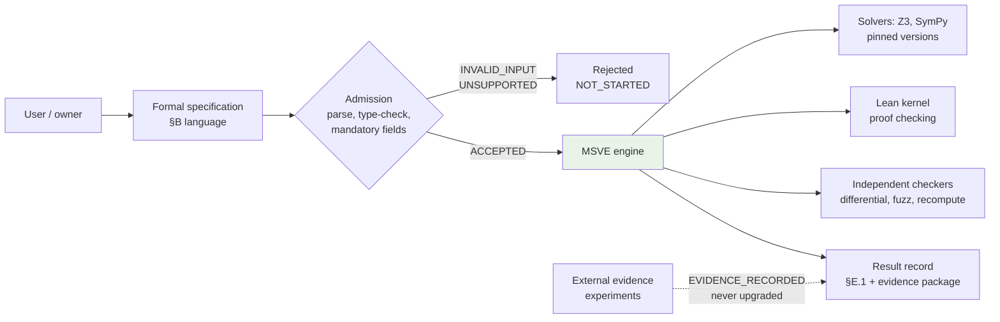
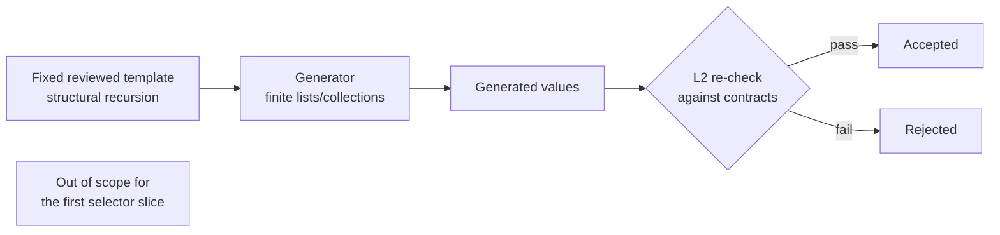
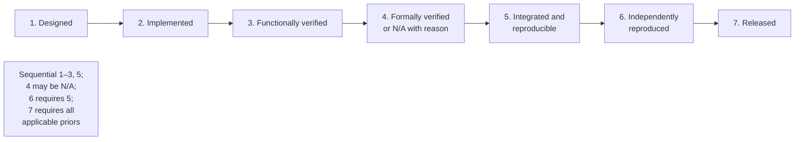

# Report B — Design Evidence — Review, Matrix, Acceptance, Visualisation (Part 4)

**Work Order:** 0.8.2 · **Source file:** `(four files)` (DIRECT ARTEFACT, sha256 `-…`)

Complete original text, unmodified. Part 4 of 6. Single part; each document complete.

---


## File: `six-docs/MSVE_DESIGN_REVIEW_v0.8.md` (sha256 `d5650027ba245e0c9…`)

# MSVE Design Review v0.8

**Status:** DRAFT FOR REVIEW · **Version:** 0.8
**Supersedes:** `MSVE_DESIGN_REVIEW_v0.7.md` (historical draft)
**Normative companion:** `MSVE_DESIGN_SPEC_v0.8.md`

## 1. Review mandate

This document records the v0.8 review: the v0.7 adversarial findings, the
v0.8 correction pass, the M8 audit tool, the Phase D independent
sub-agent reviews, the lead's adjudication, and the release-gate decision.

## 2. v0.7 review outcome (carried)

The v0.7 external adversarial review produced five critical blockers
(B-01–B-05) and reopened D-025–D-033 areas. The v0.7 gate was **BLOCKED**.
The v0.7 documents remain historical drafts, unmodified.

**B-01 – B-05 → v0.8 disposition:**

| Finding | v0.8 correction | Ledger |
|---|---|---|
| B-01 (record literals ungrammatical) | D-025: `RecordLit` production, R13, M8 corpus | D-025 |
| B-02 (canonical form gaps) | D-026 (`-0` rejected), D-027 (escapes, rationals, envelopes) | D-026, D-027 |
| B-03 (decoder invariant) | D-028: contract false-branch conjunct | D-028 |
| B-04 (error model) | D-029: three closed types | D-029 |
| B-05 (packaging/schema) | D-030: `output_packaging`, refs, invariants 15–22 | D-030 |

## 3. M8 audit tool (Phase B)

M8 (`m8/`) is a real lexer/parser/name-resolver/type-checker for the MSVE
surface language, built from the v0.8 grammar. It is an audit tool under
test, not an oracle. See `m8/README.md` and `m8/runs/2026-10-09-m8-build.md`
for the implementation record, the twelve corrected tool defects, and the
B-01 negative control.

**Executed results (2026-10-09, on the final v0.8 package):**

| Check | Result |
|---|---|
| `python3 -m m8.cli corpus` | 0 failures (36 cases) |
| `python3 -m m8.cli spec-examples` | 0 failures (6/6 valid pass; 5/5 invalid rejected in marked categories) |
| `python3 -m m8.cli grammar-conformance` | OK (48 productions; spec §B.3 byte-identical to generated) |
| `python3 -m m8.tests.test_canonical` | all assertions hold |
| `python3 -m m8.tests.test_grammar_conformance` | production/method coverage holds |

**What M8 does not establish:** contract satisfiability (the D-028
contract logic is hand-verified, SPECIFICATION_REVIEW); injectivity as a
machine-checked proof (structural-induction sketch); implementation
conformance (no engine exists); execution (no tests executed).

## 4. Phase D independent reviews

Four sub-agent reviewers were dispatched after a verified Phase-0
capability probe (SHA-256 `2ecd5df3…0d75b7` matched). Reviewers were
instructed to base findings on the document text and their own checks,
not on the lead's summaries. Findings were not shared between reviewers
before their initial submissions.

### 4.1 Agent A — grammar and type-system audit

**Report received 2026-10-09.** Agent A re-ran all M8 commands,
verified keyword agreement (62/62), reproduced the B-01 negative
control, and traced the §B.11 examples manually. Confirmed: D-025
integrated, §B.3 single-source-of-truth holds, no B-01 recurrence.

**Findings — all ten conceded by the lead after verification:**

| ID | Defect | Disposition |
|---|---|---|
| NEW-A1 | M8 `check_limits` stub (§B.8 unenforced) | Range + `steps:0` enforced |
| NEW-A2 | M8 missed level-a exclusion (§B.7) | `else` branch added |
| NEW-A3 | M8 never validated projection paths (§B.5a) | `check_proj_paths` implemented |
| NEW-A4 | Cyclic aliases crashed M8 | `CheckError` + cycle detection |
| NEW-A5 | Unbound type names silent (§B.5) | Name-resolution error |
| NEW-A6 | Builtin shadowing accepted (§B.5) | Rejected in `collect` |
| NEW-A7 | HexFloat `-?` tokenization ambiguity | `-?` removed; unary minus |
| NEW-A8 | Function-typed locals uncallable | `check_call` extended |
| NEW-A9 | `Set<T>` no introduction form | Removed from v0 `TypeExpr` |
| NEW-A10 | Option as quantifier domain | Restricted to list/set |

10 new corpus cases added (46 total, 0 failures). Agent A's warning —
"M8's *implemented* checks have run" — is adopted as a standing rule.

### 4.2 Agent B — canonicalisation and numerical-semantics audit

**Report received 2026-10-09 ~11:37 UTC.** Agent B ran the canonical
test suite independently (PASS reproduced), ran a 2,998-value
collision-construction sweep (zero duplicate spellings accepted), and
verified the 2^-1022 boundary by hand. Confirmed: binary64 uniqueness
(A1), rational grammar (A2), envelope field order (A3), packaging
coherence (A4).

**Findings — all seven conceded by the lead after verification:**

| ID | Defect | Disposition |
|---|---|---|
| NEW-B1 | §B.4b underflow/overflow prose false at boundaries; missing rows | Corrected: exact thresholds; added `(+inf)−finite`, `0/(±inf)` |
| NEW-B2 | M8 string-escape checker more permissive than spec | Corrected in `canonical.py`; regression cases added |
| NEW-B3 | Type-name grammar contradicted "no whitespace" | Corrected to spaceless forms |
| NEW-B4 | M8 envelope skipped type-name/value validation | Corrected: `check_typename` + recursive validation |
| NEW-B5 | NaN comparisons undefined | Corrected: IEEE-style predicate rules |
| NEW-B6 | Real/Rat division by zero undefined | Corrected: `division-by-zero` execution error |
| NEW-B7 | `output_packaging`/`execution` jointly unconstrained | Corrected: invariant 15b; suffix rule stated |

Agent B's net assessment notes the pattern: "the same 'next unchecked
layer' pattern as previous rounds" — NaN entered the value domain in
D-032 but predicates were not carried through. The lead accepts this
characterization; it is recorded as a standing methodological warning.

### 4.3 Agent C — validator and result-contract audit

**Report received 2026-10-09 ~11:37 UTC.** Agent C ran M8 on the
validator example (PASS reproduced), hand-derived the D-028
counterexample through the contract (contract = `false`; the v0.7 form
re-derived to `true`), verified both invariant directions, and ran four
D-031 cases through M8 (all per §B.7).

**Confirmed:** D-028 fixed (tight oracle); D-029 domain partition
coherent; D-031 operational; D-033 sufficient for inv. 14.

**Findings — conceded by the lead:**

| ID | Defect | Disposition |
|---|---|---|
| NEW-C1 | `is_admission_error`/`is_unsupported_reason` never defined | Both `define` predicates written; M8-verified |
| NEW-C2 | `INTERNAL_ERROR` reasons unbounded (fourth domain) | Normative open-domain statement + 4 specified reasons |
| NEW-C3 | `execution`/`output_packaging` underdetermined | Duplicate of NEW-B7; fixed by inv. 15b |
| NEW-C4 | `UNIQUE_UNDER_PROJECTION` evidence-free | Invariant 23 added |
| NEW-C5 | "Evidence bundle" vague; no value-artifact list | Inv. 9/15 name the lists |

### 4.4 Agent D — regression and cross-document audit

**Report received 2026-10-09.** Agent D verified all M8 gates green,
confirmed the 7-diagram plan, the B→D mapping, the D-028 acceptance
case, and matrix claims. Found three copy-forward defects, all conceded:

| ID | Defect | Disposition |
|---|---|---|
| NEW-D1 | 3 normative links pointed to v0.7 files | Updated to v0.8 |
| NEW-D2 | Ledger D-025 misdescribed the as-built grammar | Corrected to bare-brace form |
| NEW-D3 | Diagram 3 showed the retired `is_error_code` contract | Updated to v0.8 contract |

## 5. Lead adjudication

Every material finding from Agents A–D was verified against the primary
sources before disposition:

- **Challenge method:** for each finding I located the exact spec
  section and tool code cited, reproduced the counterexample where one
  was given (or constructed it), and confirmed the expected-vs-actual
  gap before conceding.
- **Concessions:** all 24 findings (A1–A10, B1–B7, C1–C5 with C3≡B7,
  D1–D3) were conceded. No finding was rejected. Two were duplicates
  (C3 of B7), which strengthens rather than weakens the case for the fix.
- **Corrections:** each concession produced a spec or tool change plus
  a regression case. The M8 corpus grew from 36 to 46 cases; the
  canonical test suite gained 14 assertions; §B.2, §B.3, §B.4, §B.4b,
  §B.5, §B.7, §B.8, §B.9, §E.7, §G.2 were all amended.
- **Disagreements:** none required reconciliation by vote. Where agents
  overlapped (B7/C3), both derivations were checked independently.
- **What was not challenged:** the reviewers' confirmations (e.g.,
  C's D-028 derivation, B's collision sweep) were spot-checked, not
  fully re-derived — noted as a limitation below.

## 6. Verification table

| Object | Method | Result | Evidence | Limitation |
|---|---|---|---|---|
| §B.3 grammar vs `m8/grammar.py` | `grammar-conformance` (mechanical) | OK, 48 productions, byte-identical | EXECUTED_TEST | — |
| All §B.11 examples parse+type-check | `spec-examples` (mechanical) | 6/6 pass | EXECUTED_TEST | Syntax/types only |
| All §B.12 invalid examples rejected | `spec-examples` (mechanical) | 5/5 in marked categories | EXECUTED_TEST | — |
| 46-case regression corpus | `corpus` (mechanical) | 0 failures | EXECUTED_TEST | Bounded; M8's implemented checks only |
| Canonical f64/string/rational/envelope | `test_canonical` (mechanical) | All assertions hold | EXECUTED_TEST | Bounded corpus |
| B-01 negative control | Disabled record-literal branch (mechanical) | Exact v0.7 failure reproduced | EXECUTED_TEST | Monkeypatched, not historical v0.7 |
| D-028 contract logic | C's hand-derivation (both branches) | Contract rejects the counterexample | SPECIFICATION_REVIEW | Not machine-checked |
| Binary64 uniqueness | B's 2,998-value collision sweep | Zero duplicate spellings | EXECUTED_TEST | Bounded; spelling-level only |
| D-025–D-033 corrections | Spec inspection vs ledger | All present as claimed | SPECIFICATION_REVIEW | — |
| Cross-document consistency | D's audit + lead greps | 3 defects found and fixed | MECHANICAL_DOCUMENT_CHECK | Textual/structural |
| Injectivity (§G.2) | Structural-induction sketch | Argument given | SPECIFICATION_REVIEW | Not machine-checked |
| Implementation conformance | — | No engine exists | NOT_CHECKED | Out of scope (Work Order 0.8) |
| Execution of acceptance tests | — | Not authorized | NOT_CHECKED | Requires separate authorization |

## 7. Release-gate decision

**Gate: READY_FOR_OWNER_REVIEW.**

Basis: the five v0.7 blockers (B-01–B-05) are corrected under D-025–
D-033 with regression cases; the 24 Phase-D findings are all corrected
with regression cases; all mechanical gates are green; the six
documents are cross-consistent; every limitation is stated explicitly.

This decision means: the package is coherent enough for the owner's
review. It does **not** mean owner acceptance, design freeze, or
implementation authorization — each requires a separate explicit
decision.

Residual risks honestly held: (1) M8 verifies syntax/types, not
contract satisfiability or implementation conformance; (2) the
"next unchecked layer" pattern held again in v0.8 (24 new defects),
so further layers may remain; (3) the injectivity argument and the
D-028 derivation are paper, not machine-checked.

*End of MSVE_DESIGN_REVIEW_v0.8.md.*


## File: `six-docs/MSVE_CAPABILITY_MATRIX_v0.8.md` (sha256 `542fa10cd3a8cee9…`)

# MSVE Capability Matrix v0.8

**Status:** DRAFT FOR REVIEW · **Version:** 0.8
**Supersedes:** `MSVE_CAPABILITY_MATRIX_v0.7.md` (historical draft)
**Normative companion:** `MSVE_DESIGN_SPEC_v0.8.md`

Scale: Designed → Implemented → Functionally verified → Formally verified →
Integrated → Independently reproduced. "N/A (reason)" marks a stage that does
not apply. No stage is claimed without the evidence named in §D.6.

## v0 target capabilities (all Designed unless noted)

| ID | Capability | v0.8 status | Evidence / note |
|---|---|---|---|
| C1 | Formal input language (§B) | Designed | Grammar generated from `m8/grammar.py`; M8 parses + type-checks all §B.11 examples |
| C2 | Record construction (D-025) | Designed | New `Atom` production; R13 typing; M8 corpus cases |
| C3 | Binary64 canonical uniqueness (D-017/D-026) | Designed | `msve-canonical-3`; M8 canonical tests; 2000-value round-trip |
| C4 | Binary64 operational semantics (D-032) | Designed | §B.4b table; replaces the "IEEE 754" hand-wave |
| C5 | Exact Real/Rat (D-019) | Designed | Exact rational payloads; total `to_rat` |
| C6 | Three-stage validator (D-001/D-028) | Designed | Decode → validate → contract; D-028 conjunct enforced |
| C7 | Closed error model (D-029) | Designed | ValidationError / AdmissionError / UnsupportedReason |
| C8 | Result schema + packaging (D-030) | Designed | `output_packaging`; invariants 15–22 |
| C9 | Verification-item rules (D-031) | Designed | Cardinality + conflict rules; Qualifier default |
| C10 | Assurance levels L1/L2/L3 | Designed | §D.1; three claims separated |
| C11 | M8 audit tool (new) | Implemented | Lexer/parser/resolver/type-checker; 36-case corpus; see `m8/README.md` |

## Explicitly out of scope for v0

MSVE engine implementation; solver integration; chess experiments;
performance prediction; objective invention; arbitrary discovery;
inferred historical data; NL direct execution.

*End of MSVE_CAPABILITY_MATRIX_v0.8.md (draft for review).*


## File: `six-docs/MSVE_ACCEPTANCE_PLAN_v0.8.md` (sha256 `8ee1c526f135cce7…`)

# MSVE Acceptance Plan v0.8 — First Selector Vertical Slice

**Status:** DRAFT FOR REVIEW — PROPOSED, NOT AUTHORISED FOR EXECUTION
**Version:** 0.8 · **Design spec:** `MSVE_DESIGN_SPEC_v0.8.md`
**Supersedes:** `MSVE_ACCEPTANCE_PLAN_v0.7.md` (historical draft)

Normative contracts: spec Appendix 2; §B.11/§B.13; result schema §E.1.
Regression cases: `MSVE_REGRESSION_LEDGER_v0.8.md` (D-001–D-033).
Executing this plan requires separate explicit authorization. Nothing here
authorizes Order 7.2, any repository change, or any GrimChess archive
modification. **Code generation is out of scope** (spec §D.5).

**M8's role (new in v0.8).** Before any execution: `python3 -m m8.cli
spec-examples` must pass on the frozen spec (all §B.11 examples parse +
type-check; all §B.12 invalid examples rejected with marked categories),
and `python3 -m m8.cli corpus` must be green. M8 establishes
grammar/type conformance only — not contract satisfiability, not
implementation conformance.

## 1. Baseline (preserved as reported)

- PM-E0, empty-prior condition: **candidate[0] in 75/75**; determinism 75/75;
  11/75 exact ties resolved by (lower Stockfish rank, smaller UCI).
- Status: EVIDENCE_RECORDED with provenance (Order 7 publication).
- **Binding correction:** malformed-input rejection was implemented but never
  executed in Order 7. Executed here when authorized; not claimed passed until run.

## 2. Objects under test

| Object | Formal interface | Contract |
|---|---|---|
| **Abstract selector** | `CandidateSet -> Candidate` (pure) | App. 2 §A2.2–A2.4, A2.6–A2.8; whole-record membership |
| **Abstract decoder** | `RawInput -> DecodeOutcome` | §B.13 table + `DecodeOutcome` invariant + closed `ValidationError` |
| **Abstract validator** | `[Candidate] -> ValidationOutcome` | `validate` (§B.11) |
| **Validator end-to-end** | `RawInput -> ValidationOutcome` | `validator_contract` (§B.11, with D-028 conjunct) |

Invalid inputs are tested **against the validator contract**, never against the
selector contract.

## 3. End-to-end acceptance path

1. Parse/validate frozen `selector-contract/0.8.0` and the validator spec
   (D-031 cardinality/conflict rules checked at admission; M8 gate).
2. Assess the selector contract, the three-stage validator contract, and the
   §B.13 decode table; freeze.
3. Establish L1 (§4) — three claims separate; decoder-conditional.
4. Identify L2 method per claim (§5) or mark unavailable.
5. Run L3 (§6) only if a later work order authorizes execution.
6. Emit the §E.1 result record + evidence package (payload-carrying semantic
   results; `output_packaging`; required/bases/achieved + computed shortfall).
7. Assess marginal value (§7) vs the Order 7 panel.

## 4. L1 claims — three claims separated

- **(a) Abstract-model correctness** over the full `RawInput` domain, by
  structural case analysis on the §B.13 table — conditional on the table.
- **(b) Implementation conformance** (L2). **(c) Bounded tests** (L3).

| # | Claim | Kind | Proposed method | Status |
|---|---|---|---|---|
| U1–U4 | Selector: total order, unique maximum, membership, determinism | (a) | Proofs from the comparator | Proposed |
| V1 | Decoder implements the §B.13 table + invariant | (a) | Case analysis over table rows | Proposed |
| V2 | `validate` accepts exactly the semantically valid sets | (a) | Case analysis over the if-chain | Proposed |
| V3 | Contract binds accepted output to decoded input | (a) | From V1+V2; D-028 case included | Proposed |
| C1 | Canonical-3 injectivity over the supported domain | (a) | Structural induction per §G.2 | Proposed |
| R1 | Record-construction typing sound (D-025) | (a) | From R13 + M8 corpus | Proposed |

## 5. L2 conformance — per-claim method or explicit unavailability

| Claim | Proposed L2 method | Availability |
|---|---|---|
| U1–U4 → selector impl | Transcription audit + differential testing (bounded) | Proposed; capped, labelled |
| V1 (a) → decoder impl | Parser review row-by-row against §B.13 + malformed-input fuzzing (bounded) | Proposed; capped, labelled |
| V2–V3 (a) → validator impl | Code review + targeted regression cases incl. D-028 (bounded) | Proposed; capped, labelled |
| C1 (a) → encoder impl | Encoder review + round-trip/collision tests (bounded) | Proposed; capped, labelled |
| R1 (a) → M8 | M8 corpus + B-01 negative control | **Available now** (audit tool, not engine) |
| Recompute checker independence | Separation requirements (dev/test independence) | Proposed |

## 6. L3 checks (bounded; execution requires separate authorization)

- **Selector corpus:** 75 frozen snapshots; differential vs independent
  reference; property fuzzing (sizes 1/2/many, exact ties, ±1 ulp near-ties,
  signed zeros).
- **Validator corpus:** §B.13 rows as cases; semantic cases (empty →
  `empty-candidate-set`; dup UCIs → `duplicate-uci`; whitespace UCI →
  `invalid-uci`); binding probes (swapped/fabricated/omitted → contract false);
  **D-028 case:** failed decode carrying candidates → contract false.
- **Canonical cases (D-017/D-026/D-027):** the v0.6 collision pairs; the
  `p-0`/`p+0` pair (exactly one canonical); normals/subnormals/±0
  round-trip; `inf`/`-inf` encodings; NaN → packaging failure; escape
  determinism (`\u001A` vs `\u001a`); rational normal form.
- **Grammar/type cases (D-025/D-031):** record literals (valid + dup/unknown/
  missing fields); bare quantifier rejected; `-3 + 2 : Int`; `1.5 + 2` type
  error; duplicate vs conflicting verification items.
- **Schema cases (D-030):** packaging-failure records (NaN value, `value_ref
  = None`, semantic result preserved); payload→evidence resolution.
- Seeds recorded; limits stated; green fuzzing bounds claims to tested inputs.

## 7. Marginal value assessment (required in the acceptance report)

1. **L1:** universal properties proved (U1–U4; V1–V3 claim (a),
   decoder-conditional; C1; R1) — generalizing beyond the 75 positions.
2. **L2:** conformance evidence per §5; where capped at bounded evidence.
3. **L3:** coverage counts for all corpora; regression vs the 75-panel.
4. Experimentally unknown: chess strength — out of scope by design.

## 8. Worked examples

### 8.1 Tie-break

`{uci:"e2e4",rank:0,score:0.5}` vs `{uci:"d2d4",rank:0,score:0.5}` → selects
`d2d4` (smaller UCI). Matches the preserved Order 7 adapter.

### 8.2 Projection-relative uniqueness

m₁ vs m₂ selecting "e2e4": equivalent under selection projection; distinct
under probability-output projection. Projection declared before evaluation.

### 8.3 Membership-hole witness

Supplied `{uci:"e2e4",rank:0,score:0.5}`; implementation returns
`{uci:"e2e4",rank:0,score:100.0}` → `sel == c` fails → VIOLATED with witness.

### 8.4 Validator routing (D-001/D-003/D-013/D-020/D-028)

- `[{"uci":"e2e4","rank":"x","score":0.5}]` → `invalid-field-type`.
- `"[]"` → `empty-candidate-set` (via `validate`, no contradiction).
- `[{uci:"e2e4","rank":1,"score":0.5}]` → `malformed-json` (separate case).
- Swapped/fabricated candidates → contract false → VIOLATED.
- A decoder returning `{ok:true, error:some("malformed-json")}` →
  contract false (DecodeOutcome invariant).
- **D-028:** a decoder returning `{ok:false, candidates:[c],
  error:some("malformed-json")}` with `out = rejected("malformed-json")`
  → contract **false** (the `len(d.candidates) == 0` conjunct).

## 9. Discrepancy protocol (result-record terms)

| Event | Record fields |
|---|---|
| Reference vs primary disagree | CHECKER_DIVERGENCE; halt; investigate |
| Fuzz finds violation | Some(VIOLATED {witness_ref}) + witness; new frozen version |
| Timeout | TIMEOUT; labelled partials; INCONCLUSIVE {RESOURCE_EXHAUSTED} |
| Solver unknown | INCONCLUSIVE {SOLVER_UNKNOWN} |
| Empty corpus | INCONCLUSIVE {NO_TEST_CORPUS} — never vacuous HOLDS |
| UNSAT, Level A required, B only | solver_observation={UNSAT,…}; INCONCLUSIVE {ASSURANCE_REQUIREMENT_UNMET}; shortfall=true |
| Test-backed Level B | achieved=LEVEL_B, bases=[TEST_BACKED] |
| NaN / function value at packaging | PACKAGING_FAILED(output-not-encodable); semantic result preserved; execution INTERNAL_ERROR only if the failure itself is the outcome |
| Split properties | DIVERGENCE dominates; else FAIL if any FAIL |

## 10. Entry conditions (before any execution)

- [ ] Design spec v0.8 reviewed (freeze is a separate owner decision).
- [ ] Contracts (App. 2 v0.8) written, reviewed, frozen.
- [ ] M8 gates green on the frozen spec (`spec-examples`, `corpus`).
- [ ] Independent reference + recompute checker under separation requirements.
- [ ] All corpora designed, seeds recorded; ledger cases mapped.
- [ ] L2 methods per §5 confirmed or claims capped.
- [ ] Explicit authorization to execute.

*End of MSVE_ACCEPTANCE_PLAN_v0.8.md (draft for review).*


## File: `six-docs/MSVE_VISUALISATION_PLAN_v0.8.md` (sha256 `3adaf96661df8cbb…`)

# MSVE Visualisation Plan v0.8

**Status:** DRAFT FOR REVIEW · **Version:** 0.8
**Supersedes:** `MSVE_VISUALISATION_PLAN_v0.7.md` (retained as historical draft;
release gate: BLOCKED)

Mermaid source is authoritative; generated images are optional and non-normative.
**All seven diagram sources are reproduced below** (D-023 — no "retained by
reference"). Nothing absent from `MSVE_DESIGN_SPEC_v0.8.md`.

---

## Diagram 1 — System boundary and data flow

**Question it answers:** What is inside MSVE's trust boundary, and what crosses it?



## Diagram 2 — Specification-to-verification pipeline

**Question it answers:** What are the stages from spec text to result record,
and where can each failure mode land?

```mermaid
flowchart TD
    A[Spec text] --> B{Parse, type-check,<br/>mandatory fields}
    B -->|fail| F1[admission: INVALID_INPUT<br/>execution: NOT_STARTED<br/>semantic_result: None]
    B -->|pass| C{Scope & support check}
    C -->|outside| F2[admission: UNSUPPORTED]
    C -->|inside| D[Human review & freeze]
    D --> E[Dispatch to layers]
    E --> G{Execute within resource limits}
    G -->|limit hit| F3[execution: TIMEOUT<br/>partial_results labelled]
    G -->|done| S[solver_observation:<br/>SAT / UNSAT / UNKNOWN]
    S --> R[semantic_result under<br/>assurance policy]
    R --> H{Corpus check<br/>for check goals}
    H -->|empty corpus| F5[INCONCLUSIVE<br/>{NO_TEST_CORPUS}<br/>never vacuous HOLDS]
    H -->|non-empty| T{Independent check}
    T -->|disagree| F4[verification: CHECKER_DIVERGENCE<br/>per-property records kept]
    T -->|agree| P{Packaging}
    P -->|not encodable| F6[execution: INTERNAL_ERROR<br/>output-not-encodable<br/>semantic result preserved]
    P -->|ok| J[Result record:<br/>§E.1 typed schema]
```

## Diagram 3 — Validator pipeline: decode → validate → typed outcome

**Question it answers:** How does raw input become a validated candidate set,
with every rejection named and accepted data bound to the input?

```mermaid
flowchart LR
    RAW[RawInput: String] --> DEC[Decode<br/>decode_candidates<br/>§B.13 table, 10 rows<br/>deterministic priority]
    DEC -->|ok=false + error code| REJ1[rejected<br/>decoder error code]
    DEC -->|ok=true| VAL[Validate<br/>validate<br/>empty → uci → dup-uci<br/>fixed priority]
    VAL -->|rejected| REJ2[rejected<br/>semantic error code]
    VAL -->|accepted| ACC[accepted<br/>EXACTLY the decoded<br/>candidates, same order]
    CON[validator_contract:<br/>false branch: is_some(error),<br/>len(candidates)==0, is_validation_error(e),<br/>out == rejected(e)<br/>true branch: out == validate(decoded)]
    INV[Malformed inputs] -.->|tested against| DEC
    NOTE[Three separate claims:<br/>(a) abstract pipeline correct<br/>(conditional on §B.13)<br/>(b) implementation conforms<br/>(c) bounded tests found<br/>no failures in cases tested]
```

## Diagram 4 — Result record and per-property verification

**Question it answers:** How do per-property records aggregate, and what
dominates what?

```mermaid
flowchart TD
    R1[VerificationRecord 1<br/>property A: PASS] --> AGG{Summary<br/>precedence}
    R2[VerificationRecord 2<br/>property B: FAIL] --> AGG
    R3[VerificationRecord 3<br/>property A: FAIL] --> AGG
    AGG -->|any conflict on<br/>same property| DIV[CHECKER_DIVERGENCE<br/>records preserved<br/>Discrepancy OPEN]
    AGG -->|no conflict<br/>any FAIL| FAIL[FAIL]
    AGG -->|no FAIL<br/>any INCONCLUSIVE| INC[INCONCLUSIVE]
    AGG -->|all PASS| PASS[PASS]
    AGG -->|no records| NR[NOT_RUN]
    ASSUR[Assurance block:<br/>required: NONE | LEVEL_A | LEVEL_B<br/>bases: [KERNEL_PROOF |<br/>INDEPENDENT_RECOMPUTE |<br/>SOLVER_BACKED | TEST_BACKED]<br/>achieved: NONE | LEVEL_A | LEVEL_B<br/>shortfall: computed rule]
```

## Diagram 5 — SAT/UNSAT assurance flow

**Question it answers:** What may be concluded from a solver observation at
each requested assurance level?

```mermaid
flowchart TD
    O[solver_observation:<br/>SAT | UNSAT | UNKNOWN] --> Q{assurance_required?}
    Q -->|LEVEL_A| A{basis available?}
    A -->|kernel proof or<br/>recompute (derive only)| PA[LEVEL_A conclusion]
    A -->|solver only| RA[Refuse stronger claim:<br/>INCONCLUSIVE<br/>{ASSURANCE_REQUIREMENT_UNMET}<br/>shortfall = true]
    Q -->|LEVEL_B| B{level-b accepted<br/>in frozen spec?}
    B -->|yes| PB[LEVEL_B conclusion<br/>basis recorded]
    B -->|no| RB[Refuse:<br/>INCONCLUSIVE<br/>{ASSURANCE_REQUIREMENT_UNMET}]
    Q -->|NONE| N[Observation recorded<br/>no conclusion claimed]
```

## Diagram 6 — Generator input-domain boundary

**Question it answers:** What may the v0 generator produce, and what re-checks it?



## Diagram 7 — Maturity and release stages

**Question it answers:** What does each maturity stage require, in order?



---

## Image-generation prompts (bounded, optional)

**Prompt for Diagram 3 (validator pipeline):** the three-stage pipeline
(decode → validate → contract) with the contract box reading "false
branch: is_some(error), len(candidates)==0, is_validation_error(e), out
== rejected(e); true branch: out == validate(decoded candidates)". The
retired v0.7 `is_error_code` predicate must not appear.

*End of MSVE_VISUALISATION_PLAN_v0.8.md (draft for review).*
