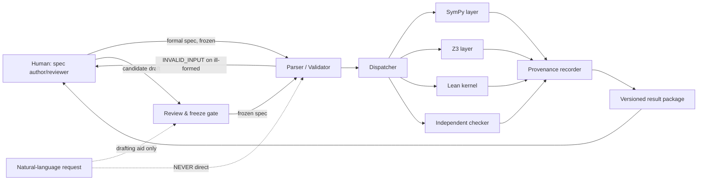
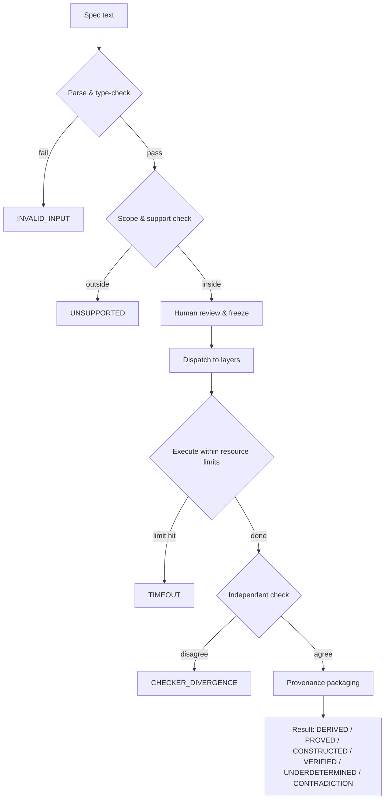
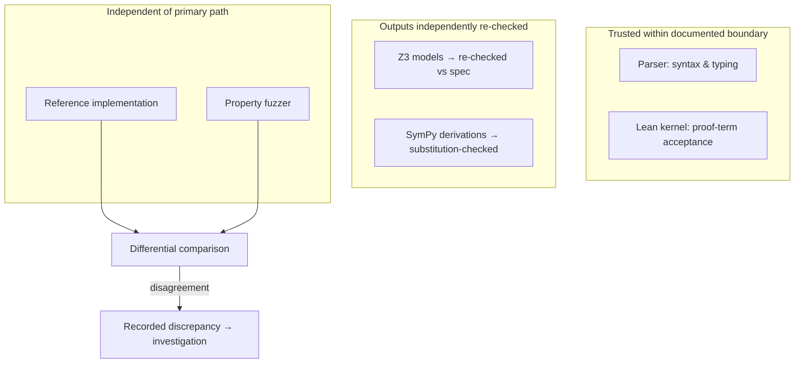
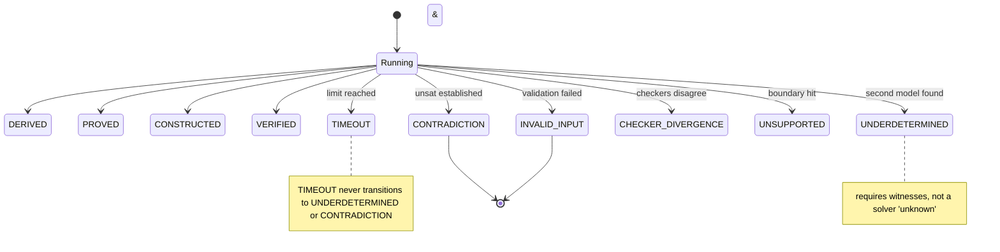
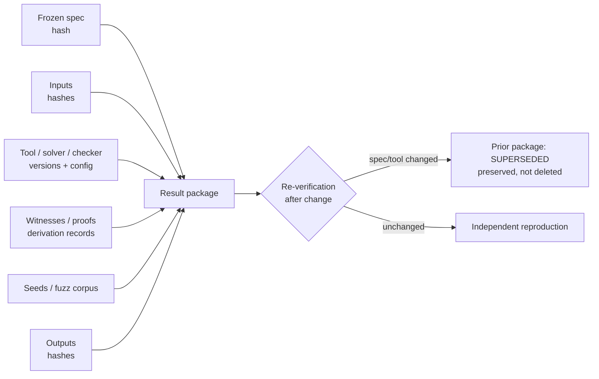

# MSVE Visualisation Plan v0.1

**Status:** DRAFT FOR REVIEW · **Version:** 0.1

Generated images are **explanatory aids, not normative specifications**. The
authoritative representation of every diagram below is its Mermaid source
(version-controlled text). Image generation, where used, must not invent
components, connections, or guarantees absent from the written spec.

---

## Diagram 1 — System boundary and data flow

**Question it answers:** What crosses MSVE's boundary, in which direction, and
what is never allowed to cross?

## Diagram 2 — Specification-to-verification pipeline

**Question it answers:** What are the ordered stages from a specification to a
verifiable result, and where can each stage fail?

## Diagram 3 — Trust boundary and independent checking

**Question it answers:** Which components are trusted for what, and where does
independent checking sit?

Labels on trust: the parser is trusted for syntax, not semantics; the kernel for
proof-term acceptance, not formalization adequacy; Z3 models are *checked*, not
trusted.

## Diagram 4 — Result-status state machine

**Question it answers:** Which statuses can an MSVE run end in, and which
transitions are forbidden?

## Diagram 5 — Provenance and evidence flow

**Question it answers:** What evidence attaches to a result, and how is it
linked tamper-evidently?

---

## Image-generation prompts (bounded, optional)

Use only if a presentation context needs rendered figures. Each prompt must
reproduce exactly the entities and relations of the corresponding Mermaid
diagram — no additions.

**Prompt for Diagram 1 (system boundary):**
> "Technical architecture diagram, flat vector style, white background. Title:
> 'MSVE System Boundary'. Boxes: 'Human (spec author/reviewer)', 'Review &
> freeze gate', 'Parser / Validator', 'Dispatcher', 'SymPy layer', 'Z3 layer',
> 'Lean kernel', 'Independent checker', 'Provenance recorder', 'Versioned result
> package', and a dashed box 'Natural-language request (drafting aid only)'.
> Solid arrows: Human → Parser (label 'formal spec, frozen'); Review gate →
> Parser ('frozen spec'); Parser → Dispatcher; Dispatcher → each layer;
> layers → Provenance recorder → result package → Human. Dashed arrows:
> natural-language box → Review gate ('drafting aid only'), and a crossed-out
> dashed arrow from the natural-language box to the Parser labeled 'NEVER
> direct'. No extra components, no decorative elements, no invented labels."

**Prompt for Diagram 4 (status state machine):**
> "Technical state diagram, flat vector style, white background. Title: 'MSVE
> Result Statuses'. One start node labeled 'Running' with arrows to eleven
> terminal states: DERIVED, PROVED, CONSTRUCTED, VERIFIED, UNDERDETERMINED,
> CONTRADICTION, TIMEOUT, CHECKER_DIVERGENCE, UNSUPPORTED, INVALID_INPUT, plus
> a note box: 'TIMEOUT never becomes UNDERDETERMINED or CONTRADICTION' and a
> note box: 'UNDERDETERMINED requires witnesses, not solver unknown'. No extra
> states, no decorative elements."

Do not generate decorative imagery. If a precise diagram or a few sentences
communicate more reliably, prefer them.

*End of MSVE_VISUALISATION_PLAN_v0.1.md (draft for review).*
