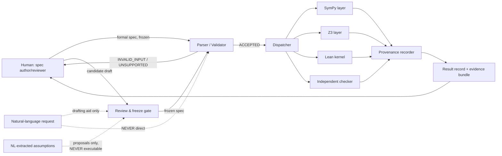
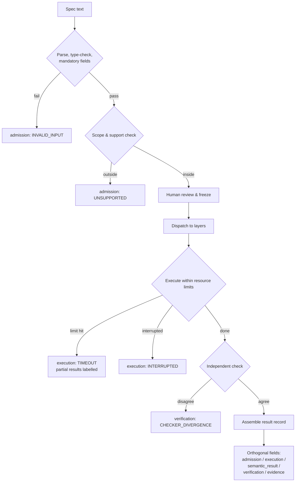
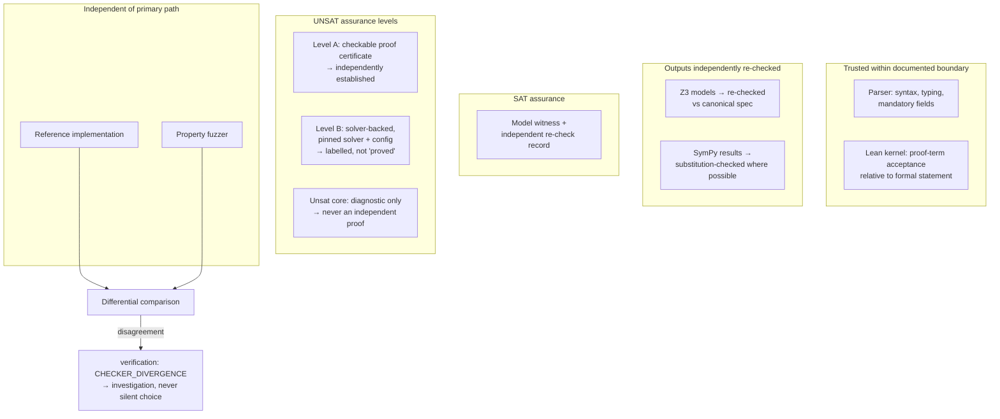
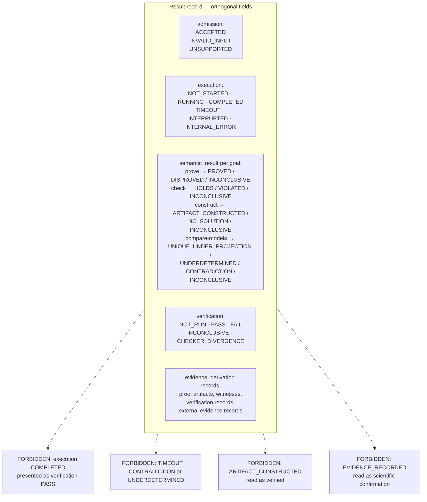
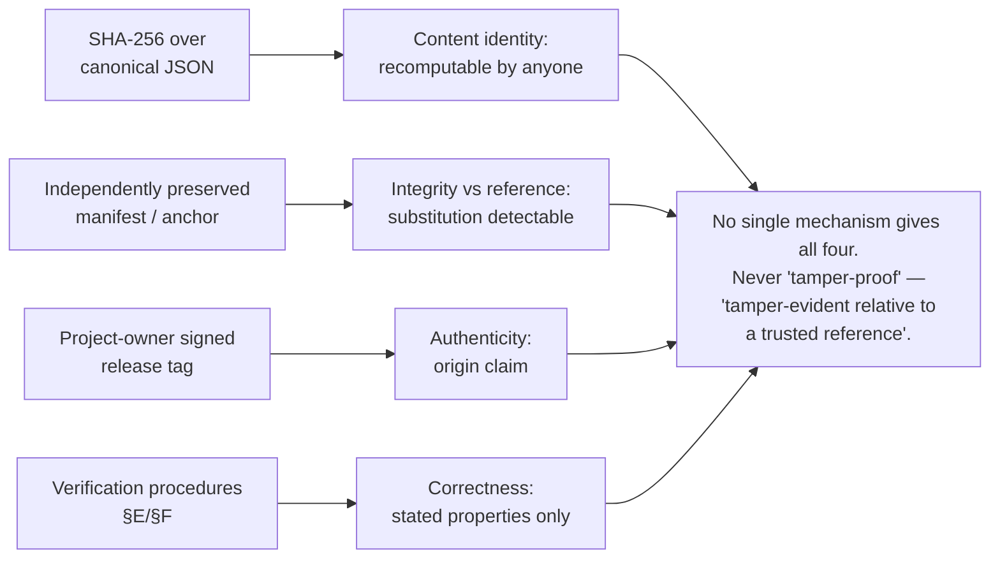

# MSVE Visualisation Plan v0.2

**Status:** DRAFT FOR REVIEW · **Version:** 0.2
**Supersedes:** `MSVE_VISUALISATION_PLAN_v0.1.md` (retained as historical draft)

Generated images are **explanatory aids, not normative specifications**. The
authoritative representation of every diagram below is its Mermaid source
(version-controlled text). Image generation, where used, must not invent
components, connections, or guarantees absent from the written spec
(`MSVE_DESIGN_SPEC_v0.2.md`).

Principal change from v0.1: Diagram 4 (flat result-status state machine) is
**replaced** — the v0.2 status architecture uses orthogonal fields, not one
state machine (Correction A, review R1).

---

## Diagram 1 — System boundary and data flow

**Question it answers:** What crosses MSVE's boundary, in which direction, and
what is never allowed to cross?

## Diagram 2 — Specification-to-verification pipeline

**Question it answers:** What are the ordered stages from a specification to a
result record, and where can each stage fail?

## Diagram 3 — Trust boundary, SAT/UNSAT assurance

**Question it answers:** Which components are trusted for what, and what
assurance level attaches to satisfiability vs. unsatisfiability claims?

## Diagram 4 — Result-status architecture (REPLACED per Correction A)

**Question it answers:** How do the orthogonal status fields compose, and which
combinations are forbidden?

*This diagram replaces the v0.1 flat state machine. Statuses are fields of one
result record, not nodes in one machine.*

Accompanying table (example legal combinations):

| admission | execution | semantic_result | verification | Reading |
|---|---|---|---|---|
| ACCEPTED | COMPLETED | PROVED | PASS | Proposition proved; independent check passed |
| ACCEPTED | COMPLETED | INCONCLUSIVE(SOLVER_UNKNOWN) | NOT_RUN | Completed run; nothing established |
| ACCEPTED | TIMEOUT | INCONCLUSIVE(RESOURCE_EXHAUSTED) | NOT_RUN | Partial results labelled separately |
| ACCEPTED | COMPLETED | UNDERDETERMINED | PASS | Two witnesses; non-uniqueness verified |
| INVALID_INPUT | NOT_STARTED | — | NOT_RUN | Rejected before execution |
| ACCEPTED | COMPLETED | CONTRADICTION (Level B) | PASS | Unsat established solver-backed; assurance labelled |

## Diagram 5 — Provenance: separated claims

**Question it answers:** Which provenance claim does each mechanism actually support?

---

## Image-generation prompts (bounded, optional)

**Prompt for Diagram 4 (result-status architecture):**
> "Technical diagram, flat vector style, white background. Title: 'MSVE Result
> Record — Orthogonal Status Fields'. Five labeled boxes in a row: 'admission:
> ACCEPTED / INVALID_INPUT / UNSUPPORTED', 'execution: NOT_STARTED / RUNNING /
> COMPLETED / TIMEOUT / INTERRUPTED / INTERNAL_ERROR', 'semantic_result (per
> goal): PROVED / DISPROVED / HOLDS / VIOLATED / ARTIFACT_CONSTRUCTED /
> UNIQUE_UNDER_PROJECTION / UNDERDETERMINED / CONTRADICTION /
> INCONCLUSIVE(reason)', 'verification: NOT_RUN / PASS / FAIL / INCONCLUSIVE /
> CHECKER_DIVERGENCE', 'evidence: derivation, proof, witness, verification,
> external-evidence records'. Below, four red 'FORBIDDEN' note boxes:
> 'COMPLETED presented as PASS', 'TIMEOUT reported as CONTRADICTION or
> UNDERDETERMINED', 'ARTIFACT_CONSTRUCTED read as verified',
> 'EVIDENCE_RECORDED read as scientific confirmation'. No extra boxes, no
> decorative elements, no invented labels."

**Prompt for Diagram 3 (trust boundary, SAT/UNSAT):**
> "Technical diagram, flat vector style, white background. Title: 'MSVE Trust
> Boundary and Assurance Levels'. Grouped boxes: 'Trusted (documented
> boundary)': parser, Lean kernel. 'Checked': Z3 models re-checked, SymPy
> substitution-checked. 'UNSAT assurance': Level A (checkable certificate,
> independently established), Level B (solver-backed, labelled not proved),
> unsat core (diagnostic only). 'Independent': reference implementation,
> fuzzer, differential comparison. No extra components, no decorative elements."

Do not generate decorative imagery. If a precise diagram or a few sentences
communicate more reliably, prefer them.

*End of MSVE_VISUALISATION_PLAN_v0.2.md (draft for review).*
