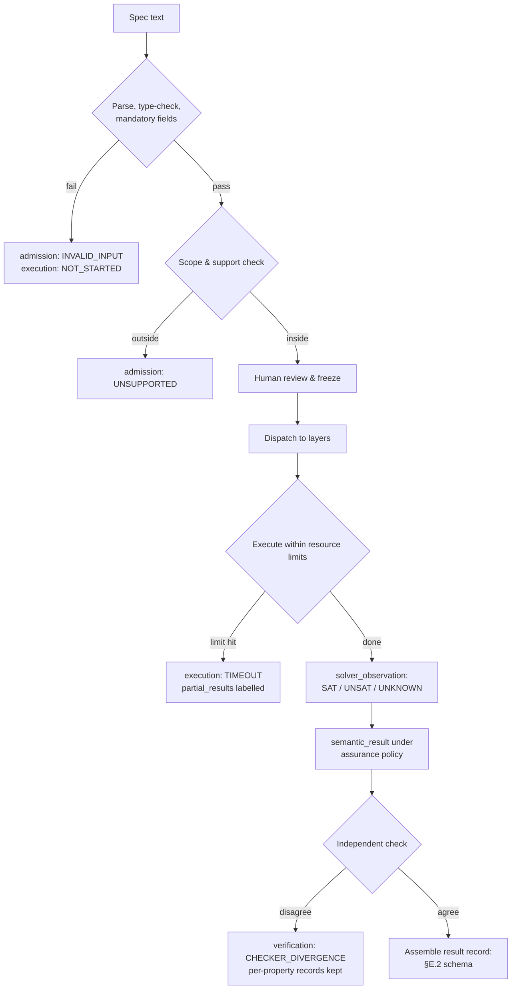
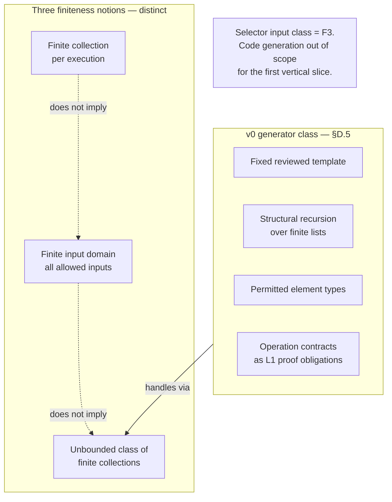
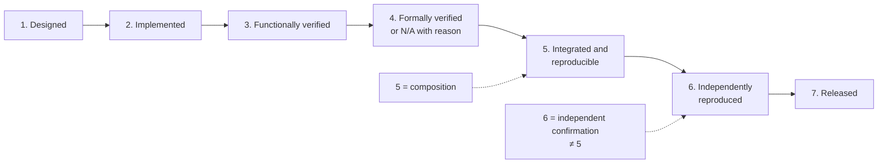

# MSVE Visualisation Plan v0.3

**Status:** DRAFT FOR REVIEW · **Version:** 0.3
**Supersedes:** `MSVE_VISUALISATION_PLAN_v0.2.md` (retained as historical draft)

Mermaid source is the authoritative explanatory diagram source; generated images
are optional and non-normative. Only diagrams whose meaning changed are updated;
unchanged diagrams are retained by reference. No visual component, connection,
or guarantee absent from `MSVE_DESIGN_SPEC_v0.3.md`.

---

## Diagram 1 — System boundary and data flow (retained from v0.2)

Unchanged in meaning. Reference: v0.2 Diagram 1.

## Diagram 2 — Specification-to-verification pipeline (updated)

**Question it answers:** What are the ordered stages, and which result-record
fields does each stage populate?



## Diagram 3 — Selector comparator and validation boundary (new, Correction A/D)

**Question it answers:** Where does validation end and selection begin, and what
does the comparator actually prefer?

```mermaid
flowchart LR
    RAW[Raw input] --> VAL[Admission validator<br/>App.2 §A2.5 checklist]
    VAL -->|reject + defect named| REJ[INVALID_INPUT]
    VAL -->|accept| WF[Well-formed CandidateSet]
    WF --> SEL[Abstract selector<br/>prefers comparator]
    SEL --> OUT[Unique maximal candidate]
    subgraph CMP [prefers(a,b) — explicit, mixed directions]
        C1[higher score] --> C2[equal score → lower rank]
        C2 --> C3[equal score+rank →<br/>smaller UCI, bytewise UTF-8]
    end
    SEL -.-> CMP
    NOTE[No single maximizable key tuple.<br/>v0.2 formula contradicted clause 3.]
```

## Diagram 4 — Result record and per-property verification (updated, Correction F)

**Question it answers:** What fields does a result record carry, and how is the
verification summary computed without hiding outcomes?

```mermaid
flowchart TB
    subgraph REC [ResultRecord — §E.2]
        ADM[admission]
        EXE[execution]
        SEM[semantic_result per goal]
        SOL[solver_observation<br/>SAT/UNSAT/UNKNOWN + provenance]
        ASR[assurance_required /<br/>achieved / shortfall]
        VR[verification_records[]<br/>per property, attributable]
        SUM[verification_summary<br/>computed: FAIL > DIVERGENCE ><br/>INCONCLUSIVE > PASS; empty → NOT_RUN]
        EVI[evidence bundle]
        PRT[partial_results]
        DIS[discrepancies + follow-up]
    end
    VR --> SUM
    FORB[FORBIDDEN: summary hiding<br/>an individual FAIL or<br/>INCONCLUSIVE record]
```

## Diagram 5 — SAT/UNSAT assurance flow (updated, Correction C)

**Question it answers:** When does a solver's UNSAT become a reported conclusion,
and when is it refused?

```mermaid
flowchart TD
    SO[solver_observation: UNSAT<br/>tool + version + config + provenance] --> Q{assurance_required?}
    Q -->|LEVEL_A| QA{Level A certificate<br/>available?}
    QA -->|yes| RA[semantic_result: CONTRADICTION<br/>assurance_achieved: LEVEL_A]
    QA -->|no| RB[semantic_result:<br/>INCONCLUSIVE<br/>(ASSURANCE_REQUIREMENT_UNMET)<br/>assurance_shortfall: true<br/>observation + Level B evidence preserved]
    Q -->|LEVEL_B accepted| RC[semantic_result: CONTRADICTION<br/>assurance_achieved:<br/>LEVEL_B_SOLVER_BACKED<br/>clearly attached]
    UC[Unsat core] -.->|diagnostic only| SO
```

Note: v0 policy — Level A for SMT UNSAT is FUTURE; the RB path is the live one
for solver-backed unsatisfiability in v0.

## Diagram 6 — Generator input-domain boundary (new, Correction E)

**Question it answers:** What does the v0 generator class cover, and what do
the three finiteness notions mean?



## Diagram 7 — Maturity and release stages (updated, Correction H)

**Question it answers:** What is the one shared vocabulary, and what evidence
advances a claim?



All documents use these exact stage names. "All-rounder within scope S, matrix
vX.Y" is earned only at stage 7 with evidence.

---

## Image-generation prompts (bounded, optional)

**Prompt for Diagram 3 (selector comparator and validation boundary):**
> "Technical diagram, flat vector style, white background. Title: 'Selector:
> Validation Boundary and Comparator'. Left to right: box 'Raw input' → box
> 'Admission validator (checklist §A2.5)' with two outgoing arrows: down to
> 'INVALID_INPUT (defect named)' and right to 'Well-formed CandidateSet' →
> box 'Abstract selector (prefers comparator)' → box 'Unique maximal
> candidate'. Below, a sub-box 'prefers(a,b): 1. higher score; 2. equal score →
> lower rank; 3. equal score+rank → smaller UCI (bytewise UTF-8)'. A note:
> 'No single maximizable key tuple'. No extra components, no decorative elements."

**Prompt for Diagram 5 (UNSAT assurance flow):**
> "Technical flowchart, flat vector style, white background. Title: 'UNSAT:
> Observation vs Reportable Conclusion'. Top box: 'solver_observation: UNSAT
> (tool + version + config + provenance)'. Diamond: 'assurance_required?'
> Branch LEVEL_A → diamond 'Level A certificate available?' → yes:
> 'CONTRADICTION, assurance LEVEL_A'; no: 'INCONCLUSIVE
> (ASSURANCE_REQUIREMENT_UNMET), shortfall true, observation preserved'. Branch
> 'LEVEL_B accepted': 'CONTRADICTION, assurance LEVEL_B_SOLVER_BACKED,
> clearly attached'. Dashed note: 'Unsat core: diagnostic only'. No extra
> elements."

*End of MSVE_VISUALISATION_PLAN_v0.3.md (draft for review).*
