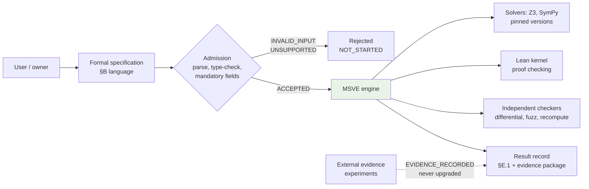
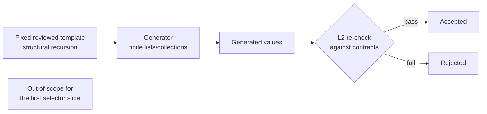
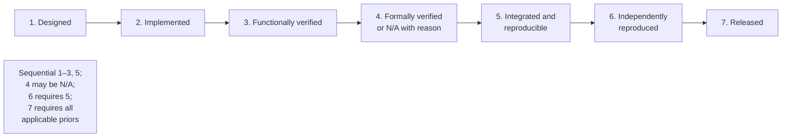

# MSVE Visualisation Plan v0.8

**Status:** DRAFT FOR REVIEW · **Version:** 0.8
**Supersedes:** `MSVE_VISUALISATION_PLAN_v0.7.md` (retained as historical draft;
release gate: BLOCKED)

Mermaid source is authoritative; generated images are optional and non-normative.
**All seven diagram sources are reproduced below** (D-023 — no "retained by
reference"). Nothing absent from `MSVE_DESIGN_SPEC_v0.8.md`.

---

## Diagram 1 — System boundary and data flow

**Question it answers:** What is inside MSVE's trust boundary, and what crosses it?



## Diagram 2 — Specification-to-verification pipeline

**Question it answers:** What are the stages from spec text to result record,
and where can each failure mode land?

```mermaid
flowchart TD
    A[Spec text] --> B{Parse, type-check,<br/>mandatory fields}
    B -->|fail| F1[admission: INVALID_INPUT<br/>execution: NOT_STARTED<br/>semantic_result: None]
    B -->|pass| C{Scope & support check}
    C -->|outside| F2[admission: UNSUPPORTED]
    C -->|inside| D[Human review & freeze]
    D --> E[Dispatch to layers]
    E --> G{Execute within resource limits}
    G -->|limit hit| F3[execution: TIMEOUT<br/>partial_results labelled]
    G -->|done| S[solver_observation:<br/>SAT / UNSAT / UNKNOWN]
    S --> R[semantic_result under<br/>assurance policy]
    R --> H{Corpus check<br/>for check goals}
    H -->|empty corpus| F5[INCONCLUSIVE<br/>{NO_TEST_CORPUS}<br/>never vacuous HOLDS]
    H -->|non-empty| T{Independent check}
    T -->|disagree| F4[verification: CHECKER_DIVERGENCE<br/>per-property records kept]
    T -->|agree| P{Packaging}
    P -->|not encodable| F6[execution: INTERNAL_ERROR<br/>output-not-encodable<br/>semantic result preserved]
    P -->|ok| J[Result record:<br/>§E.1 typed schema]
```

## Diagram 3 — Validator pipeline: decode → validate → typed outcome

**Question it answers:** How does raw input become a validated candidate set,
with every rejection named and accepted data bound to the input?

```mermaid
flowchart LR
    RAW[RawInput: String] --> DEC[Decode<br/>decode_candidates<br/>§B.13 table, 10 rows<br/>deterministic priority]
    DEC -->|ok=false + error code| REJ1[rejected<br/>decoder error code]
    DEC -->|ok=true| VAL[Validate<br/>validate<br/>empty → uci → dup-uci<br/>fixed priority]
    VAL -->|rejected| REJ2[rejected<br/>semantic error code]
    VAL -->|accepted| ACC[accepted<br/>EXACTLY the decoded<br/>candidates, same order]
    CON[validator_contract:<br/>false branch: is_some(error),<br/>len(candidates)==0, is_validation_error(e),<br/>out == rejected(e)<br/>true branch: out == validate(decoded)]
    INV[Malformed inputs] -.->|tested against| DEC
    NOTE[Three separate claims:<br/>(a) abstract pipeline correct<br/>(conditional on §B.13)<br/>(b) implementation conforms<br/>(c) bounded tests found<br/>no failures in cases tested]
```

## Diagram 4 — Result record and per-property verification

**Question it answers:** How do per-property records aggregate, and what
dominates what?

```mermaid
flowchart TD
    R1[VerificationRecord 1<br/>property A: PASS] --> AGG{Summary<br/>precedence}
    R2[VerificationRecord 2<br/>property B: FAIL] --> AGG
    R3[VerificationRecord 3<br/>property A: FAIL] --> AGG
    AGG -->|any conflict on<br/>same property| DIV[CHECKER_DIVERGENCE<br/>records preserved<br/>Discrepancy OPEN]
    AGG -->|no conflict<br/>any FAIL| FAIL[FAIL]
    AGG -->|no FAIL<br/>any INCONCLUSIVE| INC[INCONCLUSIVE]
    AGG -->|all PASS| PASS[PASS]
    AGG -->|no records| NR[NOT_RUN]
    ASSUR[Assurance block:<br/>required: NONE | LEVEL_A | LEVEL_B<br/>bases: [KERNEL_PROOF |<br/>INDEPENDENT_RECOMPUTE |<br/>SOLVER_BACKED | TEST_BACKED]<br/>achieved: NONE | LEVEL_A | LEVEL_B<br/>shortfall: computed rule]
```

## Diagram 5 — SAT/UNSAT assurance flow

**Question it answers:** What may be concluded from a solver observation at
each requested assurance level?

```mermaid
flowchart TD
    O[solver_observation:<br/>SAT | UNSAT | UNKNOWN] --> Q{assurance_required?}
    Q -->|LEVEL_A| A{basis available?}
    A -->|kernel proof or<br/>recompute (derive only)| PA[LEVEL_A conclusion]
    A -->|solver only| RA[Refuse stronger claim:<br/>INCONCLUSIVE<br/>{ASSURANCE_REQUIREMENT_UNMET}<br/>shortfall = true]
    Q -->|LEVEL_B| B{level-b accepted<br/>in frozen spec?}
    B -->|yes| PB[LEVEL_B conclusion<br/>basis recorded]
    B -->|no| RB[Refuse:<br/>INCONCLUSIVE<br/>{ASSURANCE_REQUIREMENT_UNMET}]
    Q -->|NONE| N[Observation recorded<br/>no conclusion claimed]
```

## Diagram 6 — Generator input-domain boundary

**Question it answers:** What may the v0 generator produce, and what re-checks it?



## Diagram 7 — Maturity and release stages

**Question it answers:** What does each maturity stage require, in order?



---

## Image-generation prompts (bounded, optional)

**Prompt for Diagram 3 (validator pipeline):** the three-stage pipeline
(decode → validate → contract) with the contract box reading "false
branch: is_some(error), len(candidates)==0, is_validation_error(e), out
== rejected(e); true branch: out == validate(decoded candidates)". The
retired v0.7 `is_error_code` predicate must not appear.

*End of MSVE_VISUALISATION_PLAN_v0.8.md (draft for review).*
